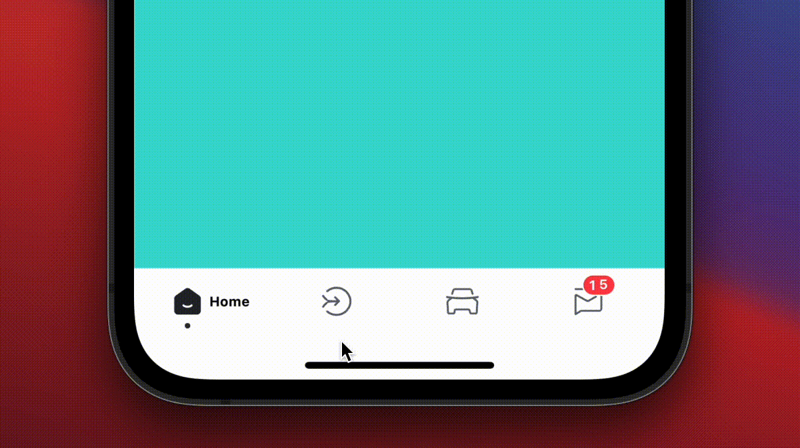

<div align="center">
  <blockquote><i>`JSThread` to `JSThread`, `UIThread` to `UIThread`.</i></blockquote>
  <h1 align="center">React Native Lottie Tabbar</h1>
  <h3 align="center">A lottie animation tab bar written in react-native-reanimated v2.</h3>
</div>


<div align="center">
  
  <br/> 
</div>

## Installation

First you have to follow installation instructions of [react-native-reanimated v2](https://docs.swmansion.com/react-native-reanimated/) and [react-native-lottie](https://github.com/lottie-react-native/lottie-react-native).

⚠️ Currently only supported `react-navigation >=5`.

```sh
npm install react-native-lottie-tabbar
or
yarn add react-native-lottie-tabbar
```

## Usage

```tsx
import { createBottomTabNavigator } from '@react-navigation/bottom-tabs';
import { NavigationContainer } from '@react-navigation/native';
import React, { useEffect, useState } from 'react';
import { View } from 'react-native';
import LottieTabbar, { TabItem } from 'react-native-lottie-tabbar';
const BottomTab = createBottomTabNavigator();

export enum RootScreenEnum {
  RootTab1 = 'home',
  RootTab2 = 'community',
  RootTab3 = 'cars',
  RootTab4 = 'notice',
}

const getViewStyle = (color: string) => ({
  flex: 1,
  backgroundColor: color,
});

const RootTab1 = () => {
  return <View style={getViewStyle(`rgba(61, 219, 209, 1)`)} />;
};
const RootTab2 = () => {
  return <View style={getViewStyle(`rgba(0, 99, 247, 1)`)} />;
};
const RootTab3 = () => {
  return <View style={getViewStyle(`rgba(255, 61, 74, 1)`)} />;
};
const RootTab4 = () => {
  return <View style={getViewStyle(`rgba(255, 187, 0, 1)`)} />;
};

const tabs: TabItem = {
  [RootScreenEnum.RootTab1]: {
    title: 'Home',
    lottieFile: require('./lottie/home.json'),
    iconSize: 24,
    textWidth: 30,
  },
  [RootScreenEnum.RootTab2]: {
    title: 'Community',
    lottieFile: require('./lottie/community.json'),
    iconSize: 24,
    textWidth: 60,
  },
  [RootScreenEnum.RootTab3]: {
    title: 'Cars',
    lottieFile: require('./lottie/car.json'),
    iconSize: 24,
    textWidth: 24,
  },
  [RootScreenEnum.RootTab4]: {
    title: 'Message',
    lottieFile: require('./lottie/notice.json'),
    iconSize: 24,
    textWidth: 46,
    isShowBadge: true,
    badgeCount: 1,
  },
};

const App = () => {
  return (
    <NavigationContainer>
      <BottomTab.Navigator
        initialRouteName={RootScreenEnum.RootTab1}
        tabBar={(props) => <LottieTabbar {...props} tabs={tabs} />}
        screenOptions={{
          headerShown: false,
        }}
      >
        <BottomTab.Screen name={RootScreenEnum.RootTab1} component={RootTab1} />
        <BottomTab.Screen name={RootScreenEnum.RootTab2} component={RootTab2} />
        <BottomTab.Screen name={RootScreenEnum.RootTab3} component={RootTab3} />
        <BottomTab.Screen name={RootScreenEnum.RootTab4} component={RootTab4} />
      </BottomTab.Navigator>
    </NavigationContainer>
  );
};

```

## Contributing

See the [contributing guide](CONTRIBUTING.md) to learn how to contribute to the repository and the development workflow.

## License

MIT
